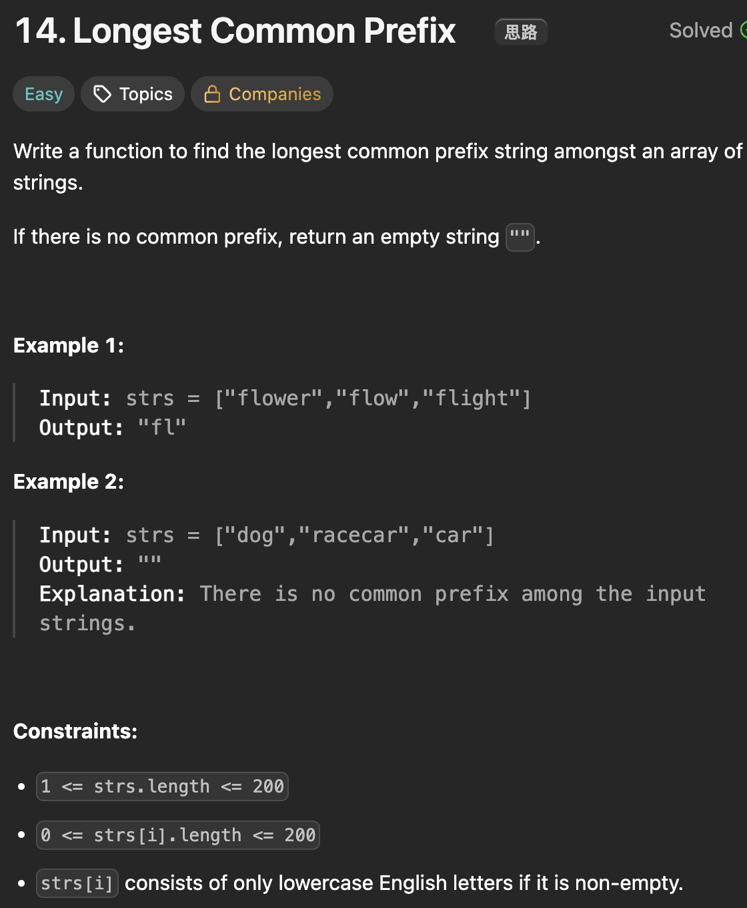

# LeetCode 14 - Longest Common Prefix

**类型**：string
**难度**：easy

---

## 一、题目描述（截图）



---

## 二、解题思路

1. 可以把字符串列看成一个二维数组，以第一个字符串作为基准，纵向也就是按列进行比较

## 三、正确解法

```java
class Solution {
    public String longestCommonPrefix(String[] strs) {
        int n = strs.length;

        String first = strs[0];

        // 纵向比较
        for (int col = 0; col < first.length(); col++) {
            for (int row = 1; row < n; row++) {
                String s = strs[row];
                if (s.length() == col || s.charAt(col) != first.charAt(col)) {
                    return first.substring(0, col);
                }
            }
        }

        return first;
    }
}
```

---

## 四、容易踩坑点

- [ ]
