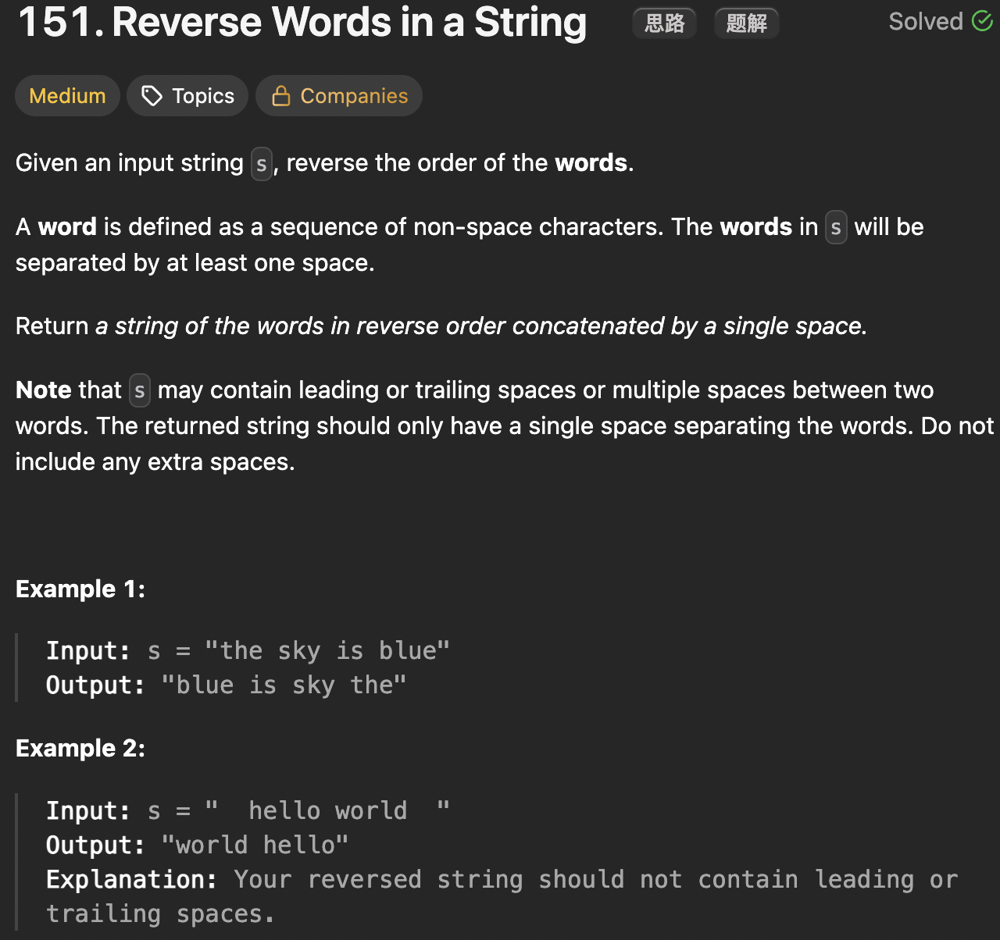

# LeetCode 151 - Reverse Words in a String

**类型**：string
**难度**：medium
**错误次数**：2

---

## 一、题目描述（截图）



---

## 二、解题思路

1. 先把多余的空格去除，再反转整个字符串，最后再依次对每个word再反转一次

## 三、正确解法

```java
// 原地反转
class Solution {
    public String reverseWords(String s) {
        // 去除空格
        StringBuilder sb = new StringBuilder();
        for (int i = 0; i < s.length(); i++) {
            char c = s.charAt(i);
            if (c != ' ') {
                sb.append(c);
            } else if (!sb.isEmpty() && sb.charAt(sb.length() - 1) != ' ') {
                sb.append(' ');
            }
        }
        if (sb.isEmpty()) {
            return "";
        }
        // 去掉最后一个空格
        if (sb.charAt(sb.length() - 1) == ' ') {
            sb.deleteCharAt(sb.length() - 1);
        }

        char[] chars = sb.toString().toCharArray();
        int n = chars.length;
        reverse(chars, 0, n - 1);
        int i = 0;
        while (i < n) {
            int j = i;
            while (j < n && chars[j] != ' ') {
                j++;
            }
            reverse(chars, i, j - 1);
            i = j + 1;
        }
        return String.valueOf(chars);


    }
    private void reverse(char[] arr, int start, int end) {
        while (start < end) {
            char temp = arr[start];
            arr[start] = arr[end];
            arr[end] = temp;
            start++;
            end--;
        }
    }
}

// 收集所有单词再反过来合并
class Solution {
    public String reverseWords(String s) {
        List<String> words = new ArrayList<>();
        int n = s.length();

        for (int i = 0; i < n; i++) {
            // 跳过每个词前面的空格
            while (i < n && s.charAt(i) == ' ') {
                i++;
            }
            if (i < n) {
                StringBuilder currentWord = new StringBuilder();
                int startIndex = i;
                while (startIndex < n && s.charAt(startIndex) != ' ') {
                    currentWord.append(s.charAt(startIndex));
                    startIndex++;
                }
                words.add(currentWord.toString());
                i = startIndex;
            }
        }
        Collections.reverse(words);
        return String.join(" ", words);
    }
}

```

---

## 四、容易踩坑点

- [ ] 跳过空格的处理不好容易出错，第二种解法对于空格的处理比较好，将每个单词和它前面的所有空格看作一对然后依次处理
