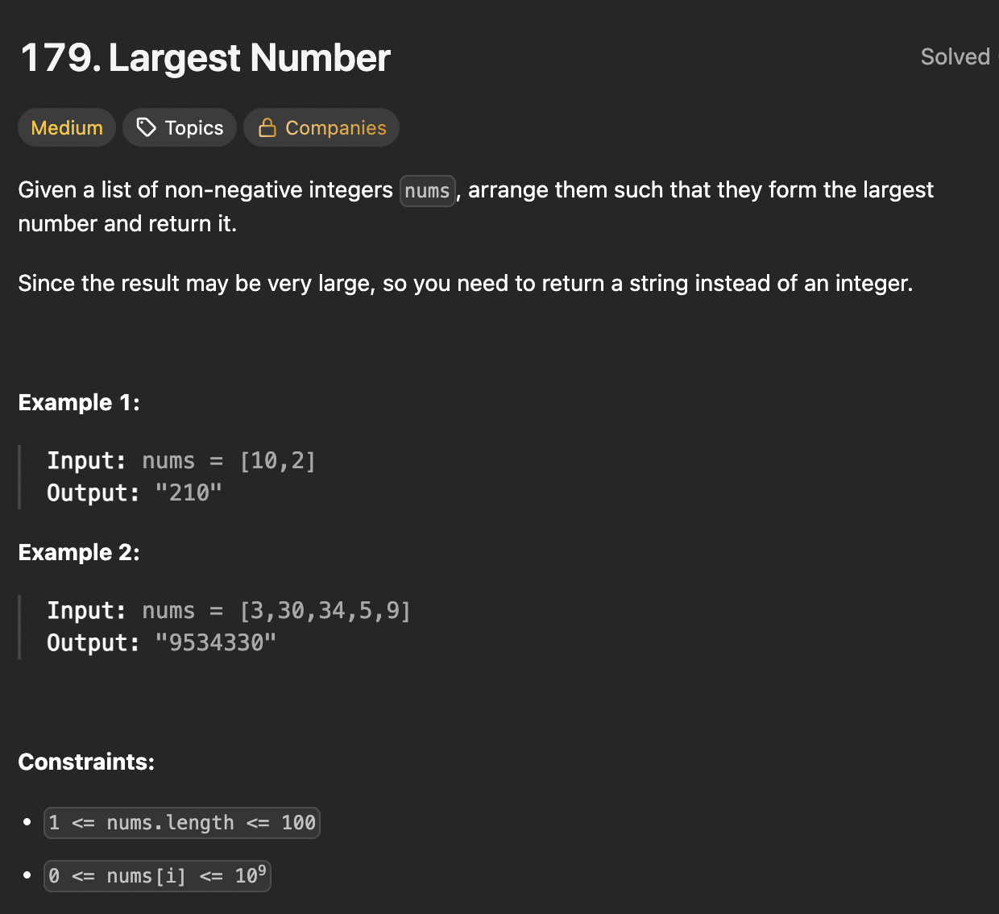

# LeetCode 179 - Largest Number

**类型**：string
**难度**：medium
**错误次数**：2
**错误原因**：直接按照现有顺序进行两两比较来确定先后顺序

---

## 一、题目描述（截图）



---

## 二、解题思路

1. 将num转换成string再按照自定义的排序规则进行降序排序
2. 这种排序规则是任意两个string进行比较，若a + b > b + a, 那么a更大，排在b前面

## 三、正确解法

```java
class Solution {
    public String largestNumber(int[] nums) {
        List<String> numStrings = new ArrayList<>();
        for (int num : nums) {
            numStrings.add(String.valueOf(num));
        }
        numStrings.sort((a, b) -> (b + a).compareTo(a + b));
        if (numStrings.get(0).equals("0")) {
            return "0";
        }
        return String.join("", numStrings);
    }
}
```

---

## 四、容易踩坑点

- [ ] 如果最大的字符串是“0”，那么所有的都是“0”，这是特殊情况
