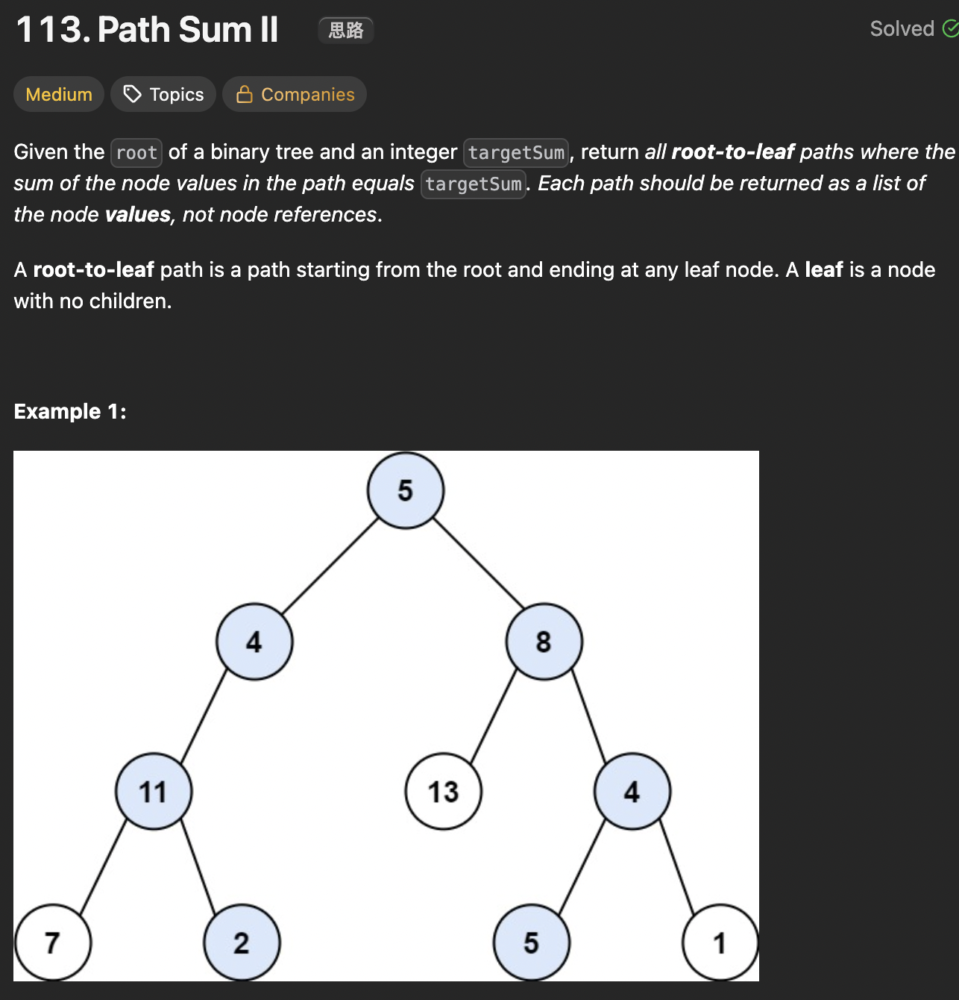

# LeetCode 113 - Path SumII

**类型**：Tree
**难度**：Medium  
**错误次数**：1

---

## 一、题目描述（截图）



---

## 二、解题思路

1. 可以遍历树来找路径
2. 可以用分解的方法，分别找到左子树以及右子树和为targetSum - root.val的路径再叠加root

## 三、正确解法

```java
class Solution {
    private List<Integer> path;
    private List<List<Integer>> result;

    private int targetSum;

    public List<List<Integer>> pathSum(TreeNode root, int targetSum) {
        this.path = new ArrayList<>();
        this.targetSum = targetSum;
        this.result = new ArrayList<>();
        if (root == null) return result;
        traverse(root, 0);
        return result;
    }

    private void traverse(TreeNode root, int currentSum) {
        if (root == null) return;

        path.add(root.val);
        currentSum += root.val;

        if (root.left == null && root.right == null) {
            if (currentSum == targetSum) {
                result.add(new ArrayList<>(path));
            }
        }

        traverse(root.left, currentSum);
        traverse(root.right, currentSum);
        path.remove(path.size() - 1);
    }
}

class Solution {
    public List<List<Integer>> pathSum(TreeNode root, int targetSum) {
        // 分解思路
        List<List<Integer>> result = new ArrayList<>();
        if (root == null) return result;

        if (root.left == null && root.right == null && root.val == targetSum) {
            List<Integer> path = new ArrayList<>();
            path.add(root.val);
            result.add(path);
            return result;
        }

        List<List<Integer>> leftResults = pathSum(root.left, targetSum - root.val);
        List<List<Integer>> rightResults = pathSum(root.right, targetSum - root.val);

        for (List<Integer> leftPath : leftResults) {
            leftPath.addFirst(root.val);
            result.add(leftPath);
        }
        for (List<Integer> rightPath : rightResults) {
            rightPath.addFirst(root.val);
            result.add(rightPath);
        }

        return result;
    }
}

```

---

## 四、容易踩坑点

- [ ] 遍历思路有点类似回溯算法，因此如果有共享变量或状态比如这里的path需要进行回溯.
