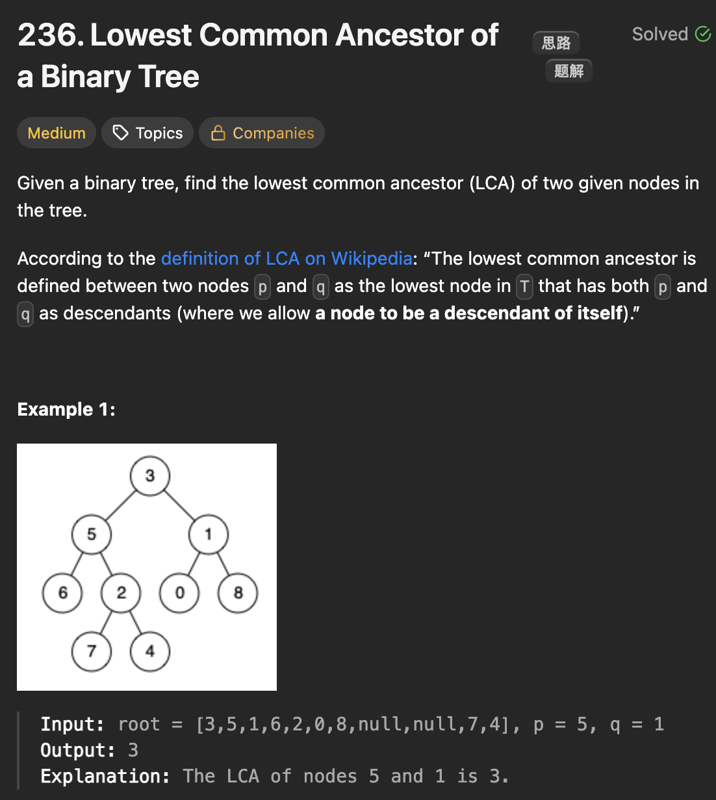

# LeetCode 236 - Lowest Common Ancestor of a Binary Tree

**类型**：Tree
**难度**：Medium

---

## 一、题目描述（截图）



---

## 二、解题思路

1. 对于一个节点，如果能够在它的左右子树中分别找到p和q，则该节点为p和q的最近公共祖先
2. 同时分别遍历左右子树，然后在后序位置作判断
3. 终止条件是：遇到p或q就返回

## 三、正确解法

```java
class Solution {
    public TreeNode lowestCommonAncestor(TreeNode root, TreeNode p, TreeNode q) {
        // base case
        if (root == null) return null;
        // p或者q是p和q的最近公共祖先
        if (root == p || root == q) return root;

        TreeNode left = lowestCommonAncestor(root.left, p, q);
        TreeNode right = lowestCommonAncestor(root.right, p, q);

        // first scenario
        if (left != null && right != null) {
            return root;
        }
        if (left == null && right == null) {
            return null;
        }
        return left == null ? right : left;
    }
}
```

---

## 四、容易踩坑点

- [ ]
