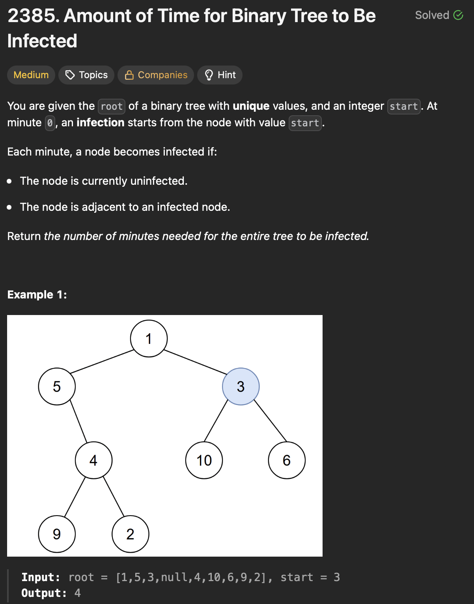

# LeetCode 2385 - Amount of Time for Binary Tree to Be Infected

**类型**：Tree
**难度**：Medium  
**错误次数**：1  
**第一次做错原因**：无向图转换没有考虑只有一个节点的情况，没有将起点放入路径中导致无效路径

---

## 一、题目描述（截图）



---

## 二、解题思路

1. 将二叉树转换成无向图，这样才既能访问子女也能访问父母
2. 一次深搜将二叉树转换成 adjacentList，二次深搜求开始节点到其他节点的最长距离

## 三、正确解法

```java
class Solution {
    public int amountOfTime(TreeNode root, int start) {
        Map<Integer, List<Integer>> adjacentList = new HashMap<>();
        traverse(adjacentList, root);
        Set<Integer> path = new HashSet<>();
        // 要将起点放入路径中，否则起点可能被访问两次
        path.add(start);
        return maxDistance(adjacentList, path, start);
    }
    private void traverse(Map<Integer, List<Integer>> list, TreeNode node) {
        if (node == null) return;
        // 如果没有左右孩子，也应将其放入list中
        list.computeIfAbsent(node.val, k -> new ArrayList<>());
        if (node.left != null) {
            list.get(node.val).add(node.left.val);
            list.computeIfAbsent(node.left.val, k -> new ArrayList<>()).add(node.val);
        }
        if (node.right != null) {
            list.get(node.val).add(node.right.val);
            list.computeIfAbsent(node.right.val, k -> new ArrayList<>()).add(node.val);
        }
        traverse(list, node.left);
        traverse(list, node.right);
    }
    private int maxDistance(Map<Integer, List<Integer>> list, Set<Integer> path, int start) {
        int res = 0;

        for (int neighbor : list.get(start)) {
            if (!path.contains(neighbor)) {
                path.add(neighbor);
                res = Math.max(res, maxDistance(list, path, neighbor) + 1);
                path.remove(neighbor);
            }
        }
        return res;
    }
}
// keep tracking previous node, make the code cleaner
class Solution {
    public int amountOfTime(TreeNode root, int start) {
        Map<Integer, List<Integer>> adjacentList = new HashMap<>();
        buildGraph(adjacentList, root, null);
        return findMaxDistance(adjacentList, start, 0);

    }
    private void buildGraph(Map<Integer, List<Integer>> adjacentList, TreeNode cur, TreeNode parent) {
        if (cur == null) return ;
        if (parent != null) {
            adjacentList.computeIfAbsent(cur.val, k -> new ArrayList<>()).add(parent.val);
            adjacentList.computeIfAbsent(parent.val, k -> new ArrayList<>()).add(cur.val);
        }
        buildGraph(adjacentList, cur.left, cur);
        buildGraph(adjacentList, cur.right, cur);
    }
    private int findMaxDistance(Map<Integer, List<Integer>> adjacentList, int currentNode, int previousNode) {
        int res = 0;
        for (int neighbor : adjacentList.getOrDefault(currentNode, Collections.emptyList())) {
            if (neighbor != previousNode) {
                res = Math.max(res, findMaxDistance(adjacentList, neighbor, currentNode) + 1);
            }
        }
        return res;
    }
}
```

---

## 四、容易踩坑点

- [ ] 二叉树只能单向遍历，但本题需要从子女访问父母，因此可以先转换成无向图
