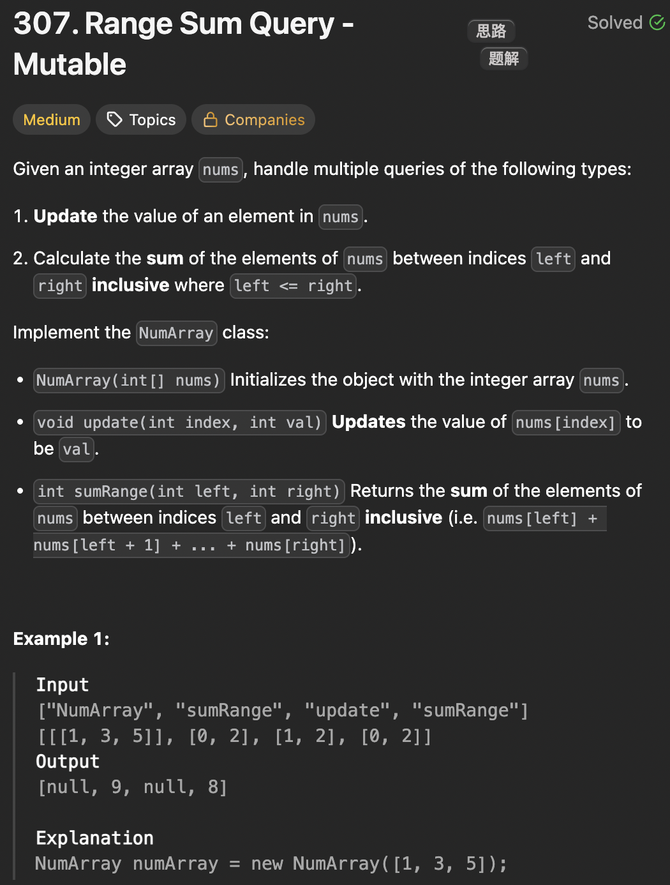

# LeetCode 307 - Range Sum Query - Mutable

**类型**：SegmentTree
**难度**：Medium

---

## 一、题目描述（截图）



---

## 二、解题思路

1. 如果array是固定不变的，那用前缀和来解就可以了
2. 对于array的值会更新，用线段树会更高效

## 三、正确解法

```java
class NumArray {
    private SegmentTree tree;

    public NumArray(int[] nums) {
        tree = new SegmentTree(nums);
    }

    public void update(int index, int val) {
        tree.update(index, val);

    }

    public int sumRange(int left, int right) {
        return tree.query(left, right);
    }
}
class SegmentNode {
    int l, r;
    int sum;
    SegmentNode left, right;

    public SegmentNode(int sum, int l, int r) {
        this.sum = sum;
        this.l = l;
        this.r = r;
    }

}
class SegmentTree {
    private final SegmentNode root;

    public SegmentTree(int[] nums) {
        this.root = build(nums, 0, nums.length - 1);
    }
    // 将nums[l...r]中的元素构建成线段树，返回根节点
    private SegmentNode build(int[] nums, int l, int r) {
        // 区间内只有一个元素，直接返回
        if (l == r) {
            return new SegmentNode(nums[l], l, r);
        }

        // 从中间切分，递归构建左右子树
        int mid = l + (r - l) / 2;
        SegmentNode left = build(nums, l, mid);
        SegmentNode right = build(nums, mid + 1, r);
        SegmentNode node = new SegmentNode(left.sum + right.sum, l, r);
        node.left = left;
        node.right = right;
        return node;
    }
    public void update(int index, int value) {
        update(root, index, value);
    }
    private void update(SegmentNode node, int index, int value) {
        if (node.l == node .r) {
            // 找到了目标叶子节点，更新值
            node.sum = value;
            return;
        }
        int mid = node.l + (node.r - node.l) / 2;
        if (index <= mid) {
            // 若index 较小，则去左子树更新
            update(node.left, index, value);
        } else {
            update(node.right, index, value);
        }
        // 后序位置，左右子树已经更新完毕，更新当前节点的聚合值
        node.sum = node.left.sum + node.right.sum;
    }
    public int query(int qL, int qR) {
        return query(root, qL, qR);
    }
    private int query(SegmentNode node, int qL, int qR) {
        if (qL > qR) {
            throw new IllegalArgumentException("Invalid query range");
        }
        if (node.l == qL && node.r == qR) {
            // 命中了目标区间，直接返回
            return node.sum;
        }
        // 未直接命中区间，需要继续向下查找
        int mid = node.l + (node.r - node.l) / 2;
        if (qR <= mid) {
            // node.l <= qL <= qR <= mid
            // 目标区间完全在左子树中
            return query(node.left, qL, qR);
        } else if (qL > mid) {
            // mid < qL <= qR <= node.r
            // 目标区间完全在右子树中
            return query(node.right, qL, qR);
        } else {
            // node.l <= qL <= mid < qR <= node.r
            // 目标区间横跨左右子树
            return query(node.left, qL, mid) + query(node.right, mid + 1, qR);
        }
    }
}
```

---

## 四、容易踩坑点

- [ ] 更新叶子里的聚合值时，在后序位置要同时更新当前节点的聚合值
