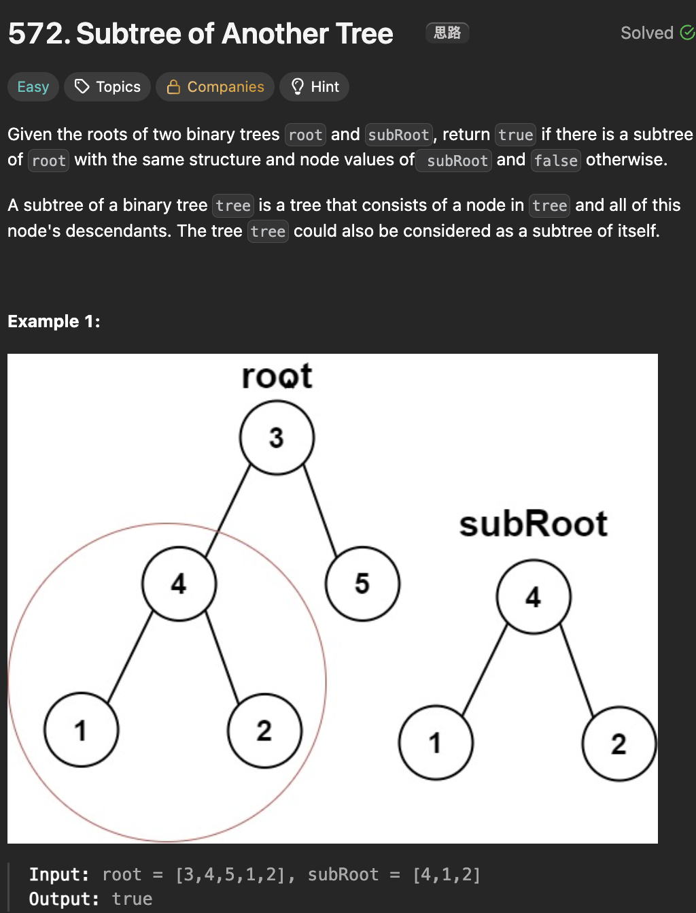

# LeetCode 572 - Subtree of Another Tree

**类型**：Tree
**难度**：Easy

---

## 一、题目描述（截图）



---

## 二、解题思路

1. 在一颗树中找到一颗子树与另一颗树完全相同，这颗子树可能是以根节点为根的树（也就是它自己）
2. 也可能是以树中其他节点为根的树，因此需要遍历每个可能的位置
3. 还需要一个helper function来比较两颗树是否完全相同

## 三、正确解法

```java
class Solution {
    public boolean isSubtree(TreeNode root, TreeNode subRoot) {
        if (subRoot == null) return true;
        if (root == null) return false;

        if (isSameTree(root, subRoot)) return true;

        return isSubtree(root.left, subRoot) || isSubtree(root.right, subRoot);

    }

    private boolean isSameTree(TreeNode treeOne, TreeNode treeTwo) {
        if (treeOne == null && treeTwo == null) return true;
        if (treeOne != null && treeTwo != null && treeOne.val == treeTwo.val) {
            return isSameTree(treeOne.left, treeTwo.left) && isSameTree(treeOne.right, treeTwo.right);
        }
        return false;
    }

}
```

---

## 四、容易踩坑点

- [ ] 考虑edge cases，不能上来就直接遍历比较每个节点，而是需要分两步操作，第一步在以root为根的树中找到一个根节点，第二步比较以该根节点为根的树和subtree是否结构和值都一样
