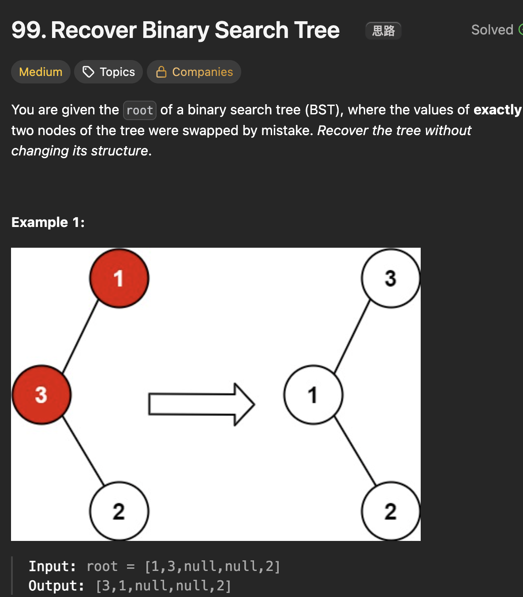

# LeetCode 99 - Recover Binary Search Tree

**类型**：Tree
**难度**：Medium  
**错误次数**：2

---

## 一、题目描述（截图）



---

## 二、解题思路

1. 二叉搜索数的特性就是中序遍历呈现递增趋势，因此可以利用中序遍历来找到错位点
2. 如果发现前后相邻的节点的值违反了递增顺序，那错位点就位于其中
3. 有两种情况：情况一两个错位节点刚好相邻，情况二有两个违反的节点对，那么第一个错位节点位于第一个违反节点对中值较大的那个，第二个错位节点位于第二个违反节点对中值较小的那个

## 三、正确解法

```java
class Solution {
    private TreeNode first = null;
    private TreeNode second = null;
    private TreeNode prev = null;

    public void recoverTree(TreeNode root) {
        inOrder(root);
        int temp =first.val;
        first.val = second.val;
        second.val = temp;
    }

    private void inOrder(TreeNode currentNode) {
        if (currentNode == null) return;

        inOrder(currentNode.left);

        if (prev != null && prev.val > currentNode.val) {
            // 第一个错位的点位于第一次violation的较大的节点
            if (first == null) first = prev;
            // 第二个错位的节点位于第一次violation的较小的节点
            // 或者第二次violation的较小的节点
            second = currentNode;
        }
        prev = currentNode;
        inOrder(currentNode.right);
    }
}
```

---

## 四、容易踩坑点

- [ ] 第一个错位的节点一定是第一次出现违反节点对中较大的那个，而第二个错位节点要不断更新second，它是第二次出现违反时较小的那个
