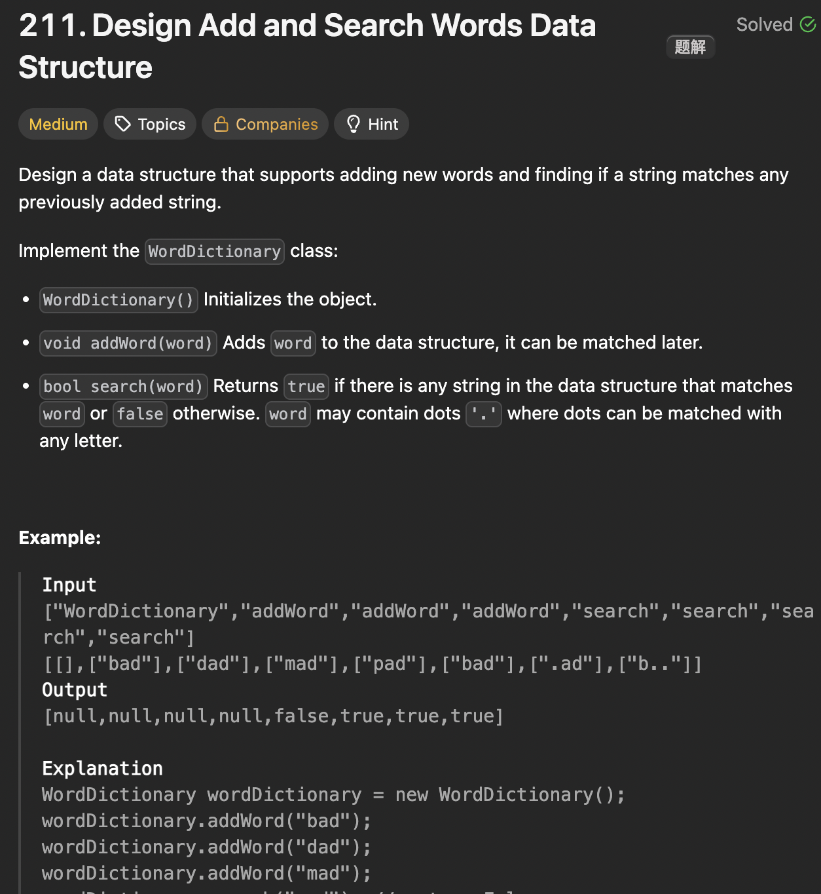

# LeetCode 211 - Design Add and Search Words Data Structure

**类型**：Trie
**难度**：medium
**错误次数**：1

---

## 一、题目描述（截图）



---

## 二、解题思路

1. 单词直接会共享前缀，所以非常合适用trie来做存储结构

## 三、正确解法

```java
class WordDictionary {
    class TrieNode {
        TrieNode[] children = new TrieNode[26];
        boolean isWord;
    }

    private TrieNode root;
    public WordDictionary() {
        root = new TrieNode();
    }

    public void addWord(String word) {
        TrieNode currentNode = root;
        for (char c : word.toCharArray()) {
            if (currentNode.children[c - 'a'] == null) {
                currentNode.children[c - 'a'] = new TrieNode();
            }
            currentNode = currentNode.children[c - 'a'];
        }
        currentNode.isWord = true;
    }

    public boolean search(String word) {
        return dfs(root, word, 0);
    }

    private boolean dfs(TrieNode node, String word, int index) {
        if (index == word.length()) {
            return node.isWord;
        }
        char c = word.charAt(index);
        if (c == '.') {
            for (TrieNode child : node.children) {
                if (child != null &&  dfs(child, word, index + 1)) {
                    return true;
                }
            }
            return false;
        } else {
            if (node.children[c - 'a'] == null) {
                return false;
            }
            return dfs(node.children[c - 'a'], word, index + 1);
        }
    }
}

```

---

## 四、容易踩坑点

- [ ] 通用符可以匹配任意字符，因此这里需要回溯来探索各种可能的路径
