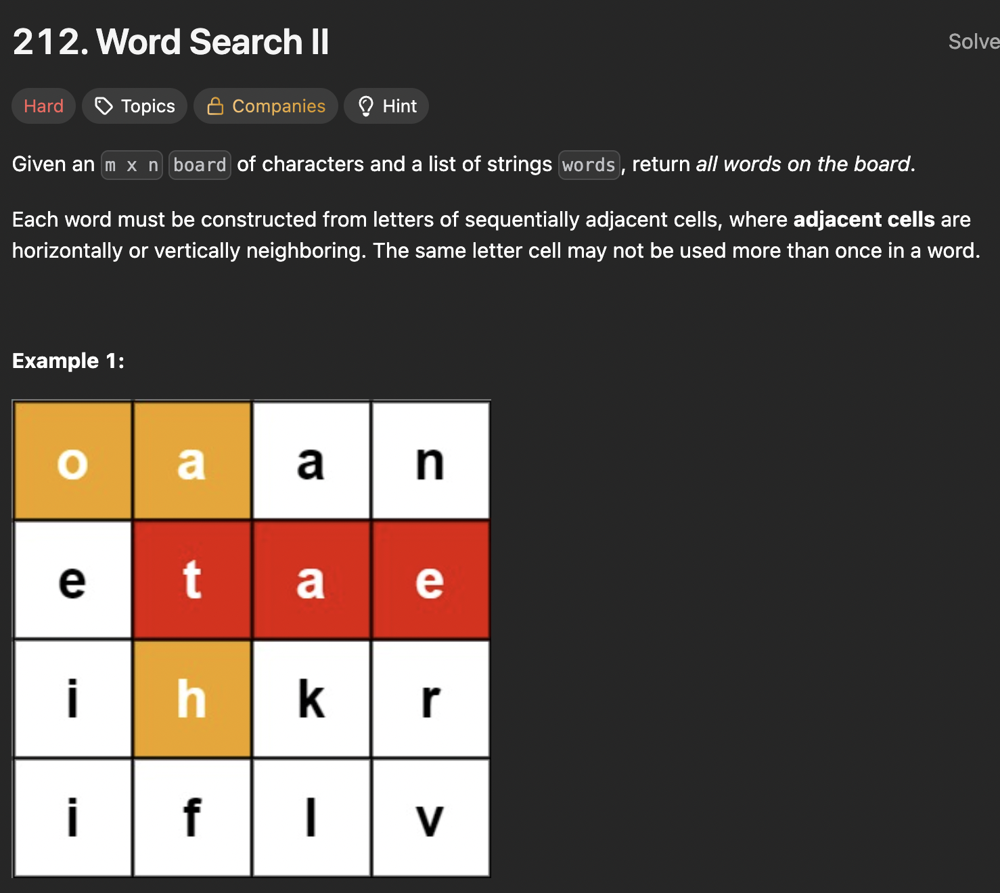

# LeetCode 212 - Word Search II

**类型**：Trie
**难度**：hard  
**错误次数**：1

---

## 一、题目描述（截图）



---

## 二、解题思路

1. 单词表中的单词可能存在有相同的前缀的情况，因此可以将他们构造成trie字典树
2. 用dfs搜索字母表同时遍历字典树，这样在一条路径上可能同时搜到多个单词

## 三、正确解法

```java
class Solution {
    class Trie {
        // 表示在单词表中的索引，-1表示不存在
        int wordIndex = -1;
        Trie[] children = new Trie[26];

        public void insert(String word, int index) {
            Trie currentNode = this;

            for (int i = 0; i < word.length(); i++) {
                int charIndex = word.charAt(i) - 'a';
                if (currentNode.children[charIndex] == null) {
                    currentNode.children[charIndex] = new Trie();
                }
                currentNode = currentNode.children[charIndex];
            }
            currentNode.wordIndex = index;
        }
    }
    public List<String> findWords(char[][] board, String[] words) {
        // 如果这些单词有重复的前缀，分开搜索每个单词可能存在重复搜索
        // 用trie结构把单词构造成trie，再用dfs在字母表上搜索路径，与trie对比
        // 如果match上了就继续，否则及时剪枝
        Trie trieRoot = new Trie();

        for (int i = 0; i < words.length; i++) {
            trieRoot.insert(words[i], i);
        }

        int rows = board.length;
        int cols = board[0].length;

        List<String> result = new ArrayList<>();
        for (int row = 0; row < rows; row++) {
            for (int col = 0; col < cols; col++) {
                dfs(board, trieRoot, row, col, words, result);
            }
        }
        return result;
    }

    private void dfs(char[][] board, Trie currentNode, int row, int col, String[] words, List<String> result) {
        int charIndex = board[row][col] - 'a';

        if (currentNode.children[charIndex] == null) {
            return;
        }

        currentNode = currentNode.children[charIndex];

        if(currentNode.wordIndex != -1) {
            result.add(words[currentNode.wordIndex]);
            // 避免其他路径上再次讲这个单词加入结果中
            currentNode.wordIndex = -1;
        }

        char originalChar = board[row][col];
        // 同一条访问路径每个cell只能访问一次
        board[row][col] = '#';

        int[] directions = {-1, 0, 1, 0, -1};

        for (int k = 0; k < 4; k++) {
            int newRow = row + directions[k];
            int newCol = col + directions[k + 1];
            if (newRow >= 0 && newRow < board.length && newCol >= 0 && newCol < board[0].length
            && board[newRow][newCol] != '#') {
                dfs(board, currentNode, newRow, newCol, words, result);
            }
        }

        board[row][col] = originalChar;
    }
}

```

---

## 四、容易踩坑点

- [ ] 避免在一个路径上多次访问同一个cell，在访问后可将其暂时改为‘#’号，之后记得回溯
