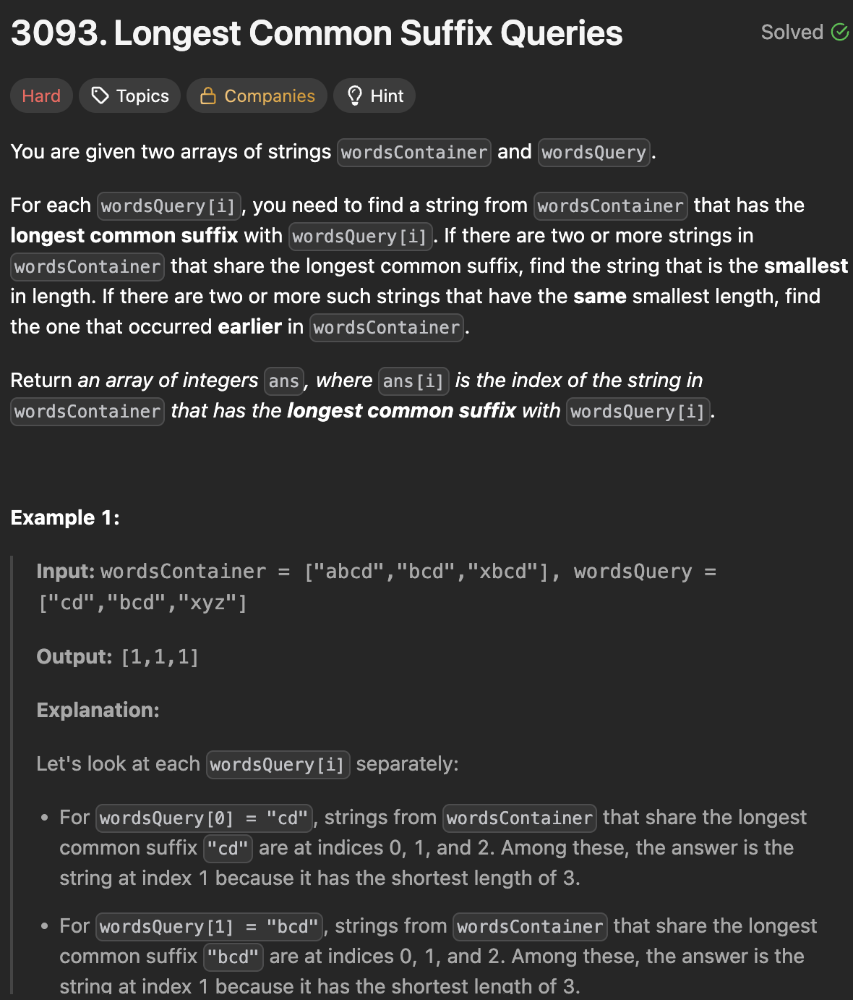

# LeetCode 3093 - Longest Common Suffix Queries

**类型**：Trie
**难度**：hard  
**错误次数**：1

---

## 一、题目描述（截图）



---

## 二、解题思路

1. 相同后缀问题类似于相同前缀问题，因此我们可以用trie数据结构来存储单词库里的单词
2. 由于是相同后缀，我们在往trie里插入单词时可以倒叙遍历单词的每个字符
3. 对于某个后缀，需要知道含有这个后缀的最短单词长度以及索引，因此可以在每个节点记录两个额外的信息：目前单词的最短长度以及对应的索引

## 三、正确解法

```java
class Solution {
    class Trie {
        Trie[] children;
        int wordIndex;
        int minLength;

        public Trie() {
            children = new Trie[26];
            wordIndex = Integer.MAX_VALUE;
            minLength = Integer.MAX_VALUE;
        }

        private void insert(String word, int index) {
            Trie currentNode = this;
            if (currentNode.minLength > word.length()) {
                currentNode.minLength = word.length();
                currentNode.wordIndex = index;
            }

            for (int charPos = word.length() - 1; charPos >= 0; charPos--) {
                int charIndex = word.charAt(charPos) - 'a';

                if (currentNode.children[charIndex] == null) {
                    currentNode.children[charIndex] = new Trie();
                }
                currentNode = currentNode.children[charIndex];

                if (currentNode.minLength > word.length()) {
                    currentNode.minLength = word.length();
                    currentNode.wordIndex = index;
                }
            }
        }

        private int query(String word) {
            Trie currentNode = this;
            for (int charPos = word.length() - 1; charPos >= 0; charPos--) {
                int charIndex = word.charAt(charPos) - 'a';
                if (currentNode.children[charIndex] == null) {
                    break;
                }
                currentNode = currentNode.children[charIndex];
            }
            return currentNode.wordIndex;
        }
    }
    public int[] stringIndices(String[] wordsContainer, String[] wordsQuery) {
        int n = wordsQuery.length;
        Trie trie = new Trie();
        for (int i = 0; i < wordsContainer.length; i++) {
            String word = wordsContainer[i];
            trie.insert(word, i);
        }
        int[] result = new int[n];
        for (int i = 0; i < n; i++) {
            result[i] = trie.query(wordsQuery[i]);
        }

        return result;
    }
}
```

---

## 四、容易踩坑点

- [ ] 如果单词库的所有单词都不共享后缀，那么相同后缀就是“”，因此所有单词都又算作满足共享后缀条件，所以需要在插入单词时根节点保存所有单词中最短单词的长度及索引
