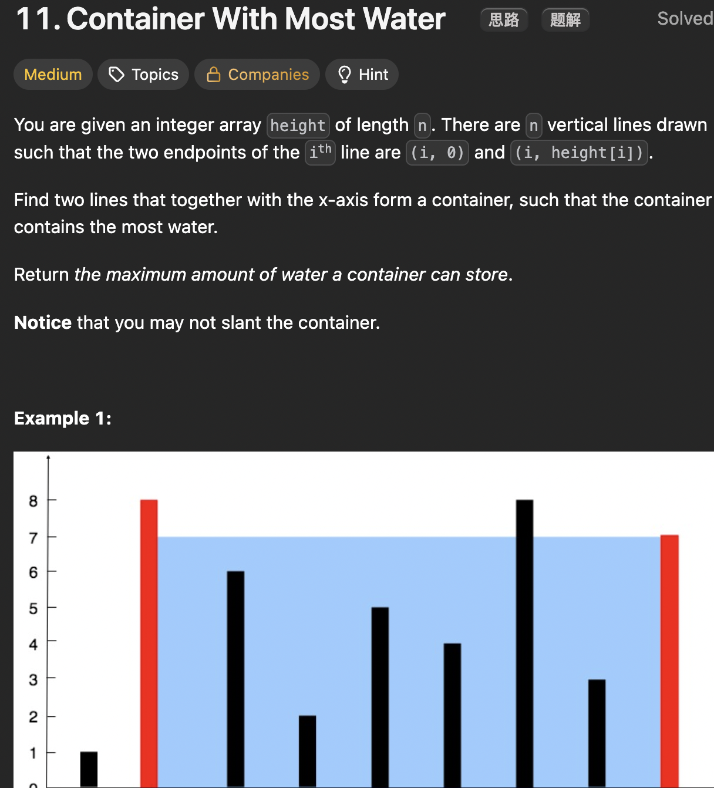

# LeetCode 11 - Container With Most Water

**类型**：two pointer
**难度**：medium

---

## 一、题目描述（截图）



---

## 二、解题思路

1. 用双指针分别指向数组的头和尾，从最大可能的宽度开始移动
2. 因为高度由较矮的一边决定，所以只有优先移动它才可能增大体积（考虑到宽度只能缩小）

## 三、正确解法

```java
class Solution {
    public int maxArea(int[] height) {
        int n = height.length;
        int left = 0, right = n - 1;
        int result = 0;
        while (left < right) {
            int cur_area = Math.min(height[left], height[right]) * (right - left);
            result = Math.max(result, cur_area);

            if (height[left] < height[right]) {
                left++;
            } else {
                right--;
            }
        }
        return result;
    }
}
```

---

## 四、容易踩坑点

- [ ] 要在更新指针前计算当前的面积并更新结果，这样才能保证指针不越界
