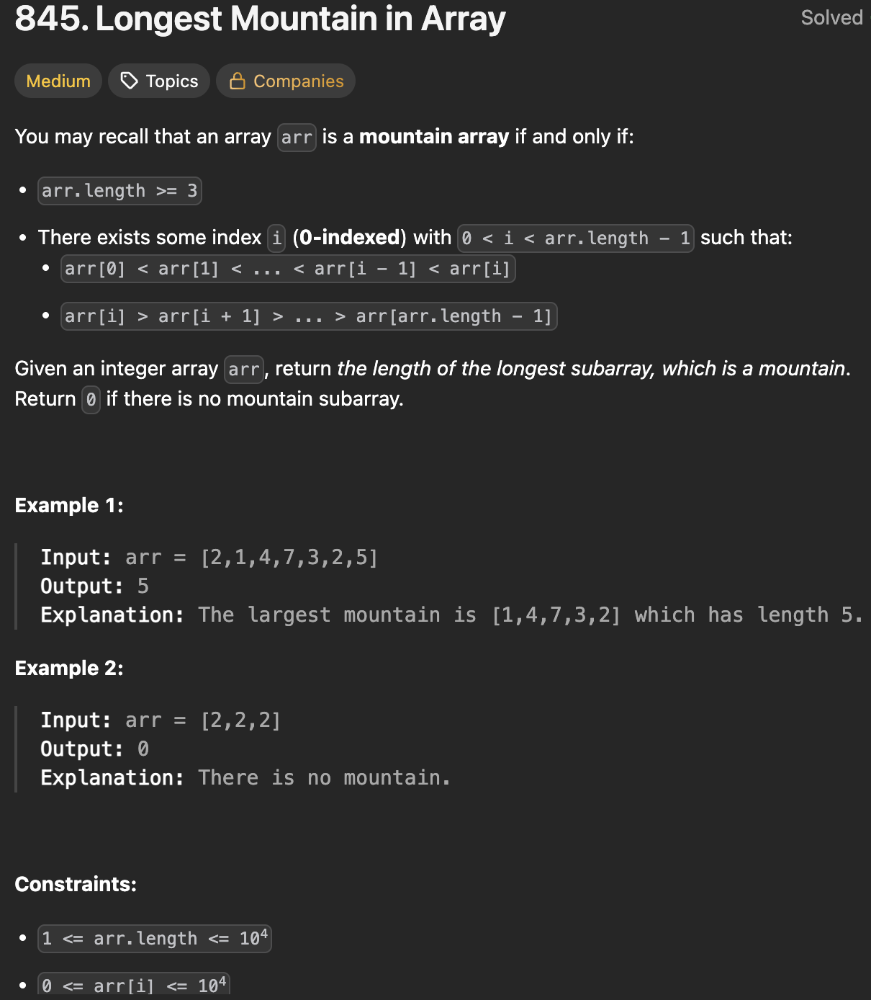

# LeetCode 845 - Longest Mountain in Array

**类型**：two pointer
**难度**：medium

---

## 一、题目描述（截图）



---

## 二、解题思路

1. 枚举山顶或者山脚
2. 枚举山顶的话，要提前计算每个位置能够向左右两边延伸多长且一直保持递减
3. 枚举山脚的话，需要用双指针，一个指针模拟左侧山脚，另一个指针模拟右侧山脚一直往前探测直到找到一个山脉

## 三、正确解法

```java
class Solution {
    public int longestMountain(int[] arr) {
        // 枚举山顶
        // 每个位置都可能成为山顶
        // 找到每个位置往两边延且大小在下降最长可到的位置
        int n = arr.length;
        // 从左边开始到该位置的最长连续递增长度
        int[] leftIncreasing = new int[n];
        Arrays.fill(leftIncreasing, 1);
        // 从右边开始到该位置的最长连续递增长度
        int[] rightIncreasing = new int[n];
        Arrays.fill(rightIncreasing, 1);
        for (int i = 1; i < n; i++) {
            if (arr[i] > arr[i - 1]) {
                leftIncreasing[i] = leftIncreasing[i - 1] + 1;
            }
        }
        for (int j = n - 2; j >= 0; j--) {
            if (arr[j] > arr[j + 1]) {
                rightIncreasing[j] = rightIncreasing[j + 1] + 1;
            }
        }
        int result = 0;
        for (int k = 1; k < n - 1; k++) {
            if (leftIncreasing[k] > 1 && rightIncreasing[k] > 1) {
                int mountainLen = rightIncreasing[k] + leftIncreasing[k] - 1;
                result = Math.max(result, mountainLen);
            }
        }
        return result;
    }
}

class Solution {
    public int longestMountain(int[] arr) {
        // 模拟山脚
        int n = arr.length;
        // left 作为左侧山脚
        int left = 0;
        int result = 0;

        // 保证山脉长度至少为3
        while (left + 2 < n) {
            // 模拟右侧山脚
            int right = left + 1;
            // left作为左侧山脚成立的条件
            if (arr[left] < arr[left + 1]) {
                // 一直爬坡到山顶
                while (right + 1 < n && arr[right] < arr[right + 1]) {
                    right++;
                }
                // 成为山顶的条件
                if (right < n - 1 && arr[right] > arr[right + 1]) {
                    while (right + 1 < n && arr[right] > arr[right + 1]) {
                        right++;
                    }

                    result = Math.max(result, right - left + 1);
                } else {
                    // 到数组尾部或者遇到平坡了，移到平坡右侧
                    right++;
                }
            }
            // 下一个新山脚
            left = right;
        }
        return result;
    }
}
```

---

## 四、容易踩坑点

- [ ] 模拟山脚思路中遇到已经访问到数组尾部或者平坡需要往前加1，以满足后面更新left的位置
