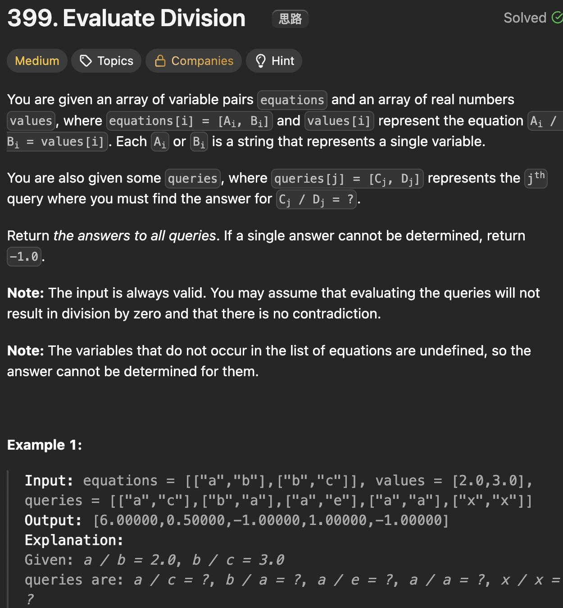

# LeetCode 212 - Word Search II

**类型**：union_find
**难度**：medium
**错误次数**：2
**错误原因**：变量之间的相对关系转化公式不对

---

## 一、题目描述（截图）



---

## 二、解题思路

1. 思路一：将变量之间的比例关系转化为有权重的有向图，再用广搜找到某两个变量之间的比例
2. 思路二：对每个等式进行广搜可能存在大量重复，效率不高，因此可以将变量之间的关系转化成并查集

## 三、正确解法

```java
class Solution1 {
    class Edge {
        String node;
        double weight;

        Edge(String node, double weight) {
            this.node = node;
            this.weight = weight;
        }
    }
    public double[] calcEquation(List<List<String>> equations, double[] values, List<List<String>> queries) {
        // 构建有向加权图
        Map<String, List<Edge>> graph = new HashMap<>();
        int len = equations.size();

        for (int i = 0; i < len; i++) {
            List<String> equation = equations.get(i);
            String from = equation.get(0), to = equation.get(1);
            if (!graph.containsKey(from)) {
                graph.put(from, new ArrayList<>());
            }
            double weight = values[i];
            graph.get(from).add(new Edge(to, weight));
            if (!graph.containsKey(to)) {
                graph.put(to, new ArrayList<>());
            }
            graph.get(to).add(new Edge(from, 1/weight));
        }

        int size = queries.size();
        double[] result = new double[size];

        for (int i = 0; i < queries.size(); i++) {
            List<String> query = queries.get(i);
            String from = query.get(0), to = query.get(1);
            double value = bfs(from, to, graph);
            result[i] = value;
        }
        return result;
    }

    private double bfs(String from, String to, Map<String, List<Edge>> graph) {
        if (!graph.containsKey(from) || !graph.containsKey(to)) {
            return -1.0;
        }

        if (from.equals(to)) {
            return 1.0;
        }

        Queue<String> que = new ArrayDeque<>();
        Set<String> visited = new HashSet<>();
        que.offer(from);
        visited.add(from);

        // key为节点ID，value记录从from到该节点的路径乘积
        Map<String, Double> weight = new HashMap<>();
        weight.put(from, 1.0);

        while (!que.isEmpty()) {
            String cur = que.poll();
            for (Edge neighbor : graph.get(cur)) {
                if (visited.contains(neighbor.node)) {
                    continue;
                }
                //更新路径乘积
                weight.put(neighbor.node, weight.get(cur) * neighbor.weight);
                if (neighbor.node.equals(to)) {
                    return weight.get(to);
                }

                visited.add(neighbor.node);
                que.offer(neighbor.node);
            }
        }
        return -1.0;
    }
}

class Solution2 {
    public double[] calcEquation(List<List<String>> equations, double[] values, List<List<String>> queries) {
        // 变量之间的关系比例图
        // 用带权重的并查集可以快速找到变量到根的权重
        Map<String, String> parent = new HashMap<>();
        Map<String, Double> weight = new HashMap<>();
        // 初始化
        for (int i = 0; i < equations.size(); i++) {
            List<String> equation = equations.get(i);
            String from = equation.get(0), to = equation.get(1);
            parent.put(from, from);
            weight.put(from, 1.0);
            parent.put(to, to);
            weight.put(to, 1.0);
        }

        // 构建并查集
        for (int i = 0; i < equations.size(); i++) {
            List<String> equation = equations.get(i);
            String from = equation.get(0), to = equation.get(1);

            String rootFrom = find(from, parent, weight);
            String rootTo = find(to, parent, weight);
            if (Objects.equals(rootFrom, rootTo)) continue;

            // union
            parent.put(rootFrom, rootTo);
            weight.put(rootFrom, weight.get(to) * values[i] / weight.get(from));
        }

            // 处理查询
        double[] result = new double[queries.size()];
        for (int i = 0; i < queries.size(); i++) {
            List<String> query = queries.get(i);
            String from = query.get(0), to = query.get(1);
            if (!parent.containsKey(from) || !parent.containsKey(to)
            || !Objects.equals(find(from, parent, weight), find(to, parent, weight))) {
                result[i] = -1.0;
            } else {
                result[i] = weight.get(from) / weight.get(to);
            }
        }
        return result;
    }


    private String find(String x, Map<String, String> parent, Map<String, Double> weight) {
        if (!Objects.equals(parent.get(x), x)) {
            String originalParent = parent.get(x);
            parent.put(x, find(originalParent, parent, weight));
            weight.put(x, weight.get(x) * weight.get(originalParent));
        }
        return parent.get(x);
    }
}
```

---

## 四、容易踩坑点

- [ ] 思路一里路径权重的乘积，用一个map来记录开始节点到当前节点的路径乘积
- [ ] union的时候是weight.get(to) \* values[i] / weight.get(from)，因为find之后weight[from] = from / rootFrom, weight[to] = to / rootTo
